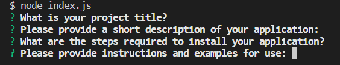
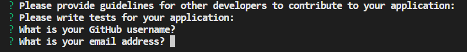
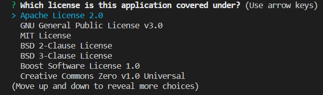
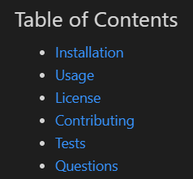

# node.js-professionalREADMEGenerator

  ## Description

  This a command-line application that helps project creators to quickly and easily create a professional README.md file from their input. It allows users to devote more time to working on the project.

  ## Table of Contents
  
  - [Usage](#usage)
  - [Video](#video)
  - [Technologies](#technologies)
  - [Installation](#installation)
  - [License](#license)
  - [Questions](#questions)

  ## Usage

  Invoke the application by using the following command:
  ```bash
  node index.js
  ```
  Then you will be prompted for inofrmation about your project. Based on your input, a README.md will be generated with the title of your project and sections entitled Description, Table of Contents, Installation, Usage, License, Contributing, Tests, and Questions.

  * You need to input information for your Project Title, Description, Installation, Usage, Contributing, Tests, and Questions.

  * As for the Questions section, you will be asked to enter your GitHub username and your email address so that other developers know how to reach you with additional questions.

    
    

  * You will be asked to choose a license for your application from a list of options. Once you choose the option, a badge for that license is added near the top of the README.md and a notice is added to the License section that explains which license your application is covered under.

    

  * When you click on the links in the Table of Contents, then you are taken to the corresponding section of the README.md.
  
    

  ## Video

  Please have a look at the walkthrough video demonstrating the functionality of this application:

  Video link: https://drive.google.com/file/d/1Pwkc4lX-IpI5JPQNVHE6AkAWr8LO68Ch/view
  
  ## Technologies

  * [Inquirer package](https://www.npmjs.com/package/inquirer/v/8.2.4)

  ## Installation

  N/A

  ## License

  N/A

  ## Questions

  If you have additional questions, feel free to reach me through github or email.

  Github: https://github.com/xybai0103
  
  Email: xueyin0103@gmail.com